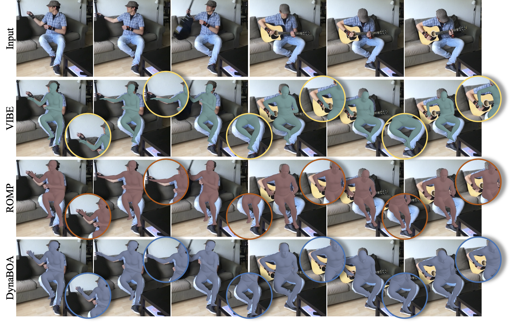

# DynaBOA

[](https://paperswithcode.com/sota/3d-human-pose-estimation-on-3dpw?p=out-of-domain-human-mesh-reconstruction-via)

Code repository for the paper:

**Out-of-Domain Human Mesh Reconstruction via Dynamic Bilevel Online Adaptation**

Shanyan Guan, Jingwei Xu, Michelle Z. He, Yunbo Wang<sup>†</sup>, Bingbing Ni, Xiaokang Yang

[[Paper]](https://arxiv.org/abs/2111.04017) [[Project Page]](https://sites.google.com/view/dynaboa)


## New feature: support web camera
<p float="center">

</p>
We support run DynaBOA with web camera. Please build Openpose first. Then, try it by     

```bash
python dynaboa_webcam.py --use_boa 1 --dynamic_boa 1 --save_video 1
```

If you want to run on an in-the-wild video, you can change `capture_mode` to `video`, and specify `vid_path`.
For example:   
```bash
python dynaboa_webcam.py --capture_mode video --vid_path $VIDPATH --use_boa 1 --dynamic_boa 1 --save_video 1
```


## Description
We focus on reconstructing human mesh from out-of-domain videos. In our experiments, we train a source model (termed as *BaseModel*) on Human 3.6M. To produce accurate human mesh on out-of-domain images, we optimize the BaseModel on target images via DynaBOA at test time. Below are the comparison results between BaseModel and the adapted model on the Internet videos with various camera parameters, motion, etc.


<p float="center">
  
</p>
<p float="center">
  
</p>
<p float="center">
  
   
</p>

---
## Get Started

DynaBOA has been implemented and tested on Ubuntu 18.04 with python = 3.6.

Clone this repo:

```bash
git clone https://github.com/syguan96/DynaBOA.git
```

Install required packages:

```bash
conda create -n DynaBOA-env python=3.6
conda activate DynaBOA-env
conda install pytorch torchvision torchaudio cudatoolkit=11.1 -c pytorch-lts -c nvidia
pip install -r requirements.txt
install spacepy following https://spacepy.github.io/install_linux.html
```

Download required file from [File 1](https://drive.google.com/file/d/1_4GhHaiNIu2aidVwMBvbdcdGd2vgy-gR/view?usp=sharing) and [File 2](https://drive.google.com/file/d/1uekfFsWnLcKdrT6CxZ9zFQFy_ySdDaXK/view?usp=sharing). After unzipping files, rename `File 1` to `data` (ensuring you do not overwrite `gmm_08.pkl` in `./data`) and move the files in `File 2` to `data/retrieval_res`. Finally, they should look like this:
```
|-- data
|   |--dataset_extras
|   |   |--3dpw_0_0.npz
|   |   |--3dpw_0_1.npz
|   |   |--...
|   |--retrieval_res
|   |   |--...
|   |--smpl
|   |   |--...
|   |--spin_data
|   |   |--gmm_08.pkl
|   |--basemodel.pt
|   |--J_regressor_extra.npy
|   |--J_regressor_h36m.npy
|   |--smpl_mean_params.npz
```

Download Human 3.6M using this [tool](https://github.com/kotaro-inoue/human3.6m_downloader), and then extract images by:
```
python process_data.py --dataset h36m
```

---
## Running on the 3DPW
Download the [3DPW](https://virtualhumans.mpi-inf.mpg.de/3DPW/) dataset. Then edit `PW3D_ROOT` in the config.py.
Then, run:
```bash
bash run_on_3dpw.sh
```

#### Results on 3DPW

| Method                                                       | Protocol | PA-MPJPE |  MPJPE   |   PVE    |
| :----------------------------------------------------------- | :------: | :------: | :------: | :------: |
| [SPIN](https://github.com/nkolot/SPIN)                       |   #PS    |   59.2   |   96.9   |  135.1   |
| [PARE](https://github.com/mkocabas/PARE)                     |   #PS    |   46.4   |   79.1   |   94.2   |
| [Mesh Graphormer](https://github.com/microsoft/MeshGraphormer) |   #PS    |   45.6   |   74.7   |   87.7   |
| DynaBOA (Ours)                                               |   #PS    | **40.4** | **65.5** | **82.0** |



---
## Running on Internet Videos

#### Prepare Data
Place videos into a folder, and record folder path by `InternetData_ROOT` in `config.py`.
Then extract images by:
```bash
python vid2img.py
```
The images are saved into `InternetData_ROOT/images`.

#### Detect 2D keypoints.
We need 2D keypoint annotations to calculate a bounding box around the person and apply constraints to the optimization process. We use AlphaPose to detect the 2D keypoints of the person. The install instruction can be found [here](https://github.com/MVIG-SJTU/AlphaPose/blob/master/docs/INSTALL.md).
After installing AlphaPose, you can use it to detect 2D keypoints. For example:
```bash
# go to the directory of Alphapose
python scripts/demo_inference.py --indir $IMAGES_DIR --outdir $RES_DIR --cfg configs/coco/resnet/256x192_res152_lr1e-3_1x-duc.yaml --checkpoint pretrained_models/fast_421_res152_256x192.pth --save_video --save_img --flip --min_box_area 300
``` 
`$IMAGES_DIR` is the directory of images to be evaluated, and `$RES_DIR` is the directory to save detected 2D keypoints. 
OpenPose also can detect accurate 2D keypoints. If you use OpenPose, you should detect `BODY_25` format keypoints. 

#### Process Data
```bash
python process_data.py --dataset internet
```

#### Run DynaBOA
```bash
bash run_on_internet.sh
```

## Acknowledgement
We borrow some code from [SPIN](https://github.com/nkolot/SPIN) and [VIBE](https://github.com/mkocabas/VIBE). [Learn2learn](https://github.com/learnables/learn2learn) is useful to implement bilevel optimization.
